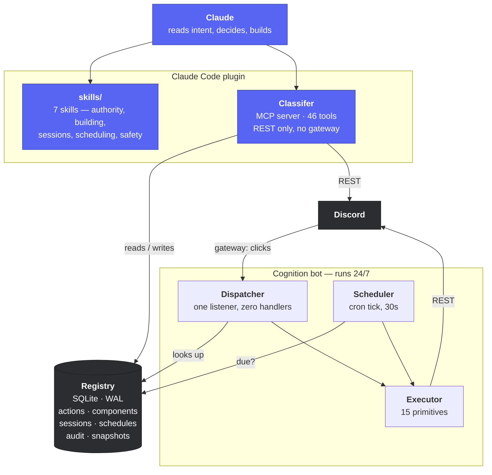
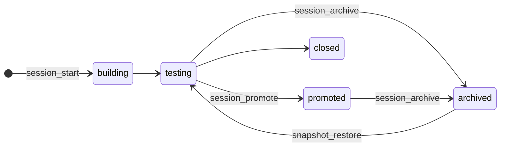
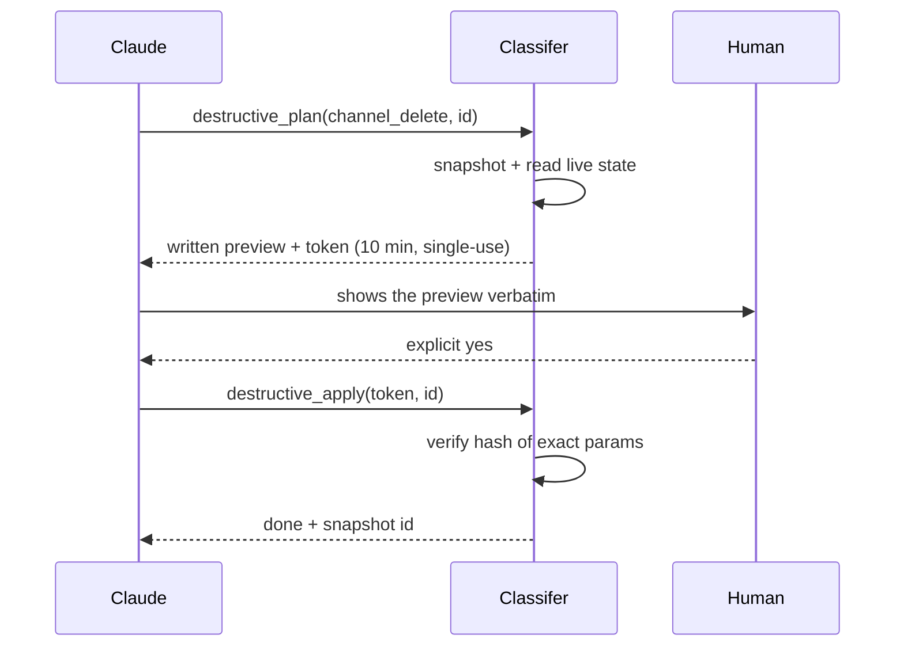

<div align="center">

# Cognition

**A Discord server that an AI operates, where behaviour is data instead of code.**

Claude holds the controls through an MCP server. The bot is a dumb executor. Adding a
feature is a database row, not a deploy — and the bot never restarts.

[](https://github.com/justpainful/Cognition/actions/workflows/ci.yml)
[](https://nodejs.org)
[](https://discord.js.org)
[](https://modelcontextprotocol.io)
[](LICENSE)

[The idea](#the-idea) · [Architecture](#architecture) · [Quick start](#quick-start) · [The Registry](#the-registry) · [Skills](#the-skills) · [Scheduling](#scheduling) · [Safety](#the-safety-model) · [Tools](#tool-reference)

</div>

---

## The idea

Most Discord bots hard-code their features. A ticket system is a handler file, a
verification flow is another, and every new idea is an edit, a restart, and a
deploy. The bot's capabilities and the bot's source code are the same thing.

Cognition separates them.

Behaviour lives in a **Registry** — a SQLite database of *actions* (what happens)
and *components* (what a button is bound to). The bot holds one interaction
listener that reads the Registry fresh on every single click. It contains no
knowledge of tickets, or verification, or anything else.

The result is that this:

```jsonc
// registry_put — the entire definition of a ticket button
{
  "key": "ticket_open",
  "kind": "channel_create",
  "params": {
    "name": "ticket-{{user.name}}",
    "parent_id": "1536064615635484766",
    "overwrites": [
      { "id": "{{guild.id}}", "type": "role",   "deny":  ["ViewChannel"] },
      { "id": "{{user.id}}",  "type": "member", "allow": ["ViewChannel", "SendMessages"] }
    ],
    "then": { "kind": "reply", "params": { "content": "Opened <#{{created.id}}>" } }
  }
}
```

…is a working, private-per-user ticket system. No file was written. No process was
restarted. The next person to press the button gets the new behaviour.

**The engine is a fixed ~20 files and does not grow when the server does.**

---

## Architecture

Two processes, deliberately.



**Why split them.** The bot needs a permanent gateway connection to receive button
presses. An MCP server lives and dies with a Claude session. Merging them would
mean the bot dies every time you close your editor.

The split buys a second property that turns out to matter more: **Classifer talks
to Discord over REST and needs no gateway at all**. The server can be inspected,
built and restructured whether or not the bot is running — and the bot keeps
answering clicks whether or not Claude Code is open.

| | Classifer (MCP) | Cognition (bot) |
|---|---|---|
| Transport | REST | Gateway (WebSocket) |
| Lifetime | One Claude session | Continuous |
| Handles | Building, reading, scheduling, safety | Button presses, modals, cron |
| Works when the other is down | ✅ | ✅ |

---

## Quick start

**Requirements** — Node ≥ 22.5 (for the built-in `node:sqlite`; nothing native to
compile), and a Discord application with Administrator in one guild.

```bash
git clone https://github.com/justpainful/Cognition.git
cd Cognition
npm install

cp .env.example .env
# DISCORD_TOKEN=...
# COGNITION_GUILD_ID=...
```

Enable **Server Members** and **Message Content** intents on the Bot page of your
application, then invite it:

```
https://discord.com/oauth2/authorize?client_id=YOUR_APP_ID&scope=bot+applications.commands&permissions=8
```

Verify everything is wired, lay out the server, and start the bot:

```bash
npm run smoke        # token, guild reachability, Registry — fails loudly and specifically
npm run bootstrap    # creates Command + Sandbox categories, #command-log, @Operator
npm run bot          # keep this running
```

Install the Claude Code plugin, then restart the app:

```bash
node scripts/install-plugin.js
```

That last step registers the marketplace, copies the plugin, and writes your
project path into the installed manifest. The checked-in manifest keeps a
placeholder, so the repo is not tied to one machine.

> **Without the plugin**, every tool is still reachable:
> ```bash
> npm run call guild_snapshot
> npm run check                 # list all 46 tools and smoke the server
> ```

---

## The Registry

### Actions

An action is `{key, kind, params, requires, confirm}`. Fifteen kinds compose into
everything:

| Group | Kinds |
|---|---|
| **Talking** | `reply` · `message_send` · `panel_send` · `log` |
| **Structure** | `channel_create` · `channel_edit` · `channel_delete`⚠ · `thread_create` · `overwrite_set` |
| **Roles** | `role_grant` · `role_revoke` |
| **Sessions** | `session_op` |
| **Control flow** | `sequence` · `branch` · `modal_open` |

They nest. `sequence` runs a list, `branch` picks by predicate, and `then` runs
after a creating action with `{{created.id}}` bound to whatever was just made.

### Predicates

`requires` gates an action, and gates **every nested action too** — so composing
something is never a way around a restriction placed on it.

```jsonc
{ "type": "has_role", "role_id": "…" }
{ "type": "all", "of": [ { "type": "is_guild_owner" }, { "type": "in_channel", "channel_id": "…" } ] }
```

Predicates **fail closed**. An unknown type, or a context missing what it needs,
evaluates false *with a reason* — and that reason is what the user sees.

### Templates

Every string parameter is a template, which is what lets one stored row serve
every user:

```
{{user.id}}  {{user.name}}  {{user.mention}}  {{user.display}}
{{channel.id}}  {{created.id}}  {{arg.0}}  {{field.<key>}}
{{session.name}}  {{guild.id}}  {{now}}  {{today}}
```

An unknown placeholder is **left standing rather than blanked**. A channel that
appears named `ticket-{{user.nmae}}` is a typo you can see; `ticket-` is a mystery.

### The custom_id scheme

Discord caps `custom_id` at 100 characters. Packing parameters into it —
`action:open_ticket|category:123|panel:456` — runs out of room as soon as a
component carries two snowflakes, and it breaks at send time.

So the id carries a Registry key and only what is genuinely per-click:

```
c1|<10-char key>|<arg0>|<arg1>
```

This is what lets **one** row serve unlimited instances. A close button in every
ticket channel is a single component; the channel it acts on rides in the id:

```jsonc
{ "kind": "panel_send", "params": {
    "channel_id": "{{created.id}}",
    "buttons": [{ "label": "Close", "component_key": "ticketclose", "args": ["{{created.id}}"] }]
}}
```

Minting a component per ticket would also work, and would leave one dead row per
ticket ever opened.

---

## The skills

The plugin ships seven skills that carry the operating model — not API docs, but
the judgement calls that a tool description cannot hold.

| Skill | What it settles |
|---|---|
| **`cognition-authority`** | Who decides. Requests are goals, not scripts. Act without asking on anything reversible; the one line that does not move. |
| **`server-read`** | Read live state before writing — and what a read *cannot* tell you |
| **`build-system`** | Composing a system from primitives instead of code |
| **`registry-authoring`** | The full grammar, and the mistakes that store cleanly and fail at click time |
| **`run-session`** | Build → test → promote or archive, without moving anything |
| **`schedule-work`** | Which of the two scheduling tiers a task belongs in |
| **`danger`** | The irreversible-operation protocol |

Descriptions carry Arabic trigger phrases alongside English, so requests in either
language route to the right skill.

---

## Sessions

Every experiment runs in a session: a `[TEST]`-tagged category, its channels, its
Registry rows, and a tracking thread in `#active-sessions`.



**Nothing ever moves between categories.** Promotion drops the `[TEST]` tag;
archiving adds `[ARCHIVED]` and denies `ViewChannel` to `@everyone`. Both happen
where the thing already stands.

That constraint buys three things: ids stay valid, message history stays intact,
and every link anyone pasted still resolves. A system that files things into an
"Archive" category breaks all three the moment it tidies up.

---

## Scheduling

Two tiers, and picking the wrong one is the usual mistake.

| | **Bot-side schedule** | **Claude routine** |
|---|---|---|
| Fired by | The Cognition process | A fresh Claude session |
| Runs when Claude Code is closed | ✅ | ❌ — runs late, on next launch |
| Can exercise judgement | ❌ fixed action tree | ✅ reads, weighs, decides |
| Can delete things | ❌ never | ❌ never — no human to confirm |
| Good for | Midnight markers, recurring posts, timed locks | "Archive whatever has gone stale" |

```bash
npm run call schedule_create '{"key":"daily_marker","cron":"3 0 * * *","action_key":"daily_marker"}'
npm run call schedule_run_now '{"key":"daily_marker"}'   # test without waiting
```

Cron is five fields in local time. The bot picks up a new schedule within 30
seconds — no restart. A schedule that already ran this minute is skipped, and that
check is against the *persisted* last-run time, so a restart mid-minute does not
double-fire either.

If the timing genuinely matters, it belongs bot-side. A 03:00 job on a machine
where the editor is closed overnight will not happen at 03:00.

---

## The safety model

Almost everything here is reversible, and the parts that are not are treated
differently.

**Snapshots.** Every structural tool captures state before it writes. Names,
topics, positions, parents, overwrites, role colours and permissions all restore
exactly — so `snapshot_restore` is a real undo, and archiving is genuinely
reversible.

**The gate.** Deletion cannot be undone: a rebuilt channel returns with a new id
and an empty history. So it takes two steps.



The token is bound to a hash of the exact parameters, so **consent given for one
deletion can never be spent on a different one**. Change the id between plan and
apply and it refuses.

What is *not* consent: a general instruction, an earlier yes, asking for it
directly, your own confidence, or a scheduled run — no human is present, so no
consent exists, so nothing gets deleted.

**Audit.** Every call, press and scheduled run becomes a row in the `audit` table.
Mutations *also* post an embed to `#command-log`; reads do not, because a channel
that logged every inspection would bury the changes.

---

## Tool reference

46 tools across seven groups. Run `npm run check` for the live list.

<details>
<summary><b>Observe</b> — reading, never writing</summary>

`guild_snapshot` · `channels_list` · `roles_list` · `members_search` ·
`messages_read` · `audit_tail` · `system_status` · `find_by_name` ·
`permissions_vocabulary` · `panel_components` · `settings_get`
</details>

<details>
<summary><b>Structure</b> — building, all reversible and snapshotted</summary>

`category_create` · `channel_create` · `channel_edit` · `channels_reorder` ·
`role_create` · `role_edit` · `role_assign` · `overwrite_set` · `server_bootstrap` ·
`settings_set`
</details>

<details>
<summary><b>Content</b></summary>

`message_send` · `message_edit` · `panel_publish`
</details>

<details>
<summary><b>Registry</b> — writing behaviour</summary>

`registry_list` · `registry_get` · `registry_put` · `registry_component_put` ·
`registry_delete` · `registry_vocabulary`
</details>

<details>
<summary><b>Sessions</b></summary>

`session_start` · `session_status` · `session_promote` · `session_archive`
</details>

<details>
<summary><b>Scheduling</b></summary>

`schedule_create` · `schedule_list` · `schedule_toggle` · `schedule_delete` ·
`schedule_run_now`
</details>

<details>
<summary><b>Safety</b></summary>

`snapshot_take` · `snapshot_list` · `snapshot_restore` ·
`snapshot_recreate_channel` · `destructive_plan` · `destructive_apply` ·
`destructive_pending`
</details>

---

## Project layout

```
Cognition/
├── shared/              the engine — imported by both processes
│   ├── store.js         node:sqlite, WAL, schema
│   ├── registry.js      actions · components · sessions · schedules
│   ├── executor.js      the 15 primitives
│   ├── predicates.js    requires / branch evaluation, fails closed
│   ├── template.js      {{...}} rendering
│   ├── customid.js      the c1|key|args scheme
│   ├── guard.js         plan/redeem tokens for irreversible ops
│   ├── snapshot.js      capture and restore
│   ├── audit.js         rows + #command-log embeds
│   ├── cron.js          5-field matcher, no dependency
│   ├── naming.js        [TEST] / [ARCHIVED] tagging
│   └── rest.js          Discord REST with rate-limit handling
│
├── classifer/src/       the MCP server
│   ├── index.js         registration and stdio transport
│   ├── kit.js           one wrapper: audit, error shaping, formatting
│   └── tools/           observe · structure · content · registry
│                        session · schedule · safety · bootstrap
├── bot/
│   ├── index.js         gateway client, six intents
│   ├── dispatcher.js    one listener, zero per-feature handlers
│   └── scheduler.js     30s tick, persisted dedup
│
├── plugin/              the Claude Code plugin (copied at install)
│   └── plugins/cognition/
│       ├── launch.js    thin launcher → the live tree via COGNITION_HOME
│       └── skills/      the seven skills
└── scripts/
    ├── smoke.js           token · guild · Registry
    ├── test-shared.js     90 unit tests, no network
    ├── call.js            any tool from the shell
    ├── classifer-check.js list tools, exercise the server
    ├── simulate-click.js  run a button without pressing it
    └── install-plugin.js  register with Claude Code
```

Note that `shared/` is imported by the bot *and* by Classifer, so a Registry action
means exactly the same thing whether a person triggered it or the clock did.

---

## Development

```bash
npm test            # 90 unit tests — cron, naming, custom_id, guard, templates,
                    # predicates, registry validation. No token needed.
npm run smoke       # needs a real token: proves token, guild and Registry
npm run check       # connects to Classifer as a real MCP client
```

**Testing a button without pressing it.** `simulate-click` runs the real Registry
row through the real templates and makes the real REST calls, as a real member with
their real roles — the same code path the Dispatcher takes:

```bash
node scripts/simulate-click.js <component_key> <user_id> '["arg0"]'
```

Use it to prove both directions of a `requires` clause: once as someone who should
be blocked, once as someone who should pass.

CI runs the unit tests on Node 22 and 24, syntax-checks every source file,
validates the plugin manifests and skill frontmatter, and fails the build if a
Discord token or a `.env` ever gets committed.

---

## FAQ

<details>
<summary><b>Buttons do nothing, but the tools all work.</b></summary>

The bot process is down. Classifer talks over REST and needs no gateway, so it stays
green while the gateway is gone. That asymmetry is deliberate but it makes the
symptom confusing — `system_status` says so explicitly rather than guessing.
</details>

<details>
<summary><b>Why not TypeScript?</b></summary>

The engine is small and fixed. The thing that actually needs validating is Registry
data, and that is validated at write time by the tool schemas — where a type system
could not help, because the rows are written at runtime by a model.
</details>

<details>
<summary><b>Why <code>node:sqlite</code> instead of better-sqlite3?</b></summary>

No native module to compile, which matters most on Windows. Both processes open the
same file, so WAL is required rather than optional.
</details>

<details>
<summary><b>A channel appeared named <code>ticket-{{user.nmae}}</code>.</b></summary>

Working as designed. Unresolvable placeholders are left standing so a typo is
visible instead of silently producing `ticket-`. Fix the row with `registry_put`;
the next press picks it up.
</details>

<details>
<summary><b>Why is it spelled "Classifer"?</b></summary>

It is the name the project's author chose for the MCP server, and renaming it now
would break every reference. It stays.
</details>

---

## License

[MIT](LICENSE)
