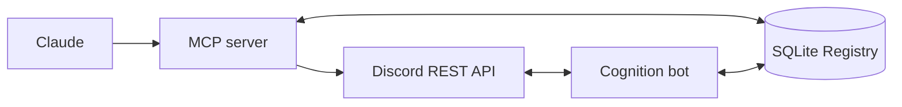

<div align="center">

# Cognition

A Discord system where behavior is stored as data and applied live.

[](https://github.com/justpainful/Cognition/actions/workflows/ci.yml)
[](https://nodejs.org)
[](https://discord.js.org)
[](https://modelcontextprotocol.io)

</div>

## Overview

Cognition separates Discord behavior from the bot source code. Actions, components, triggers and schedules live in a SQLite registry. The running bot reads that registry when an interaction happens and executes the matching behavior.

Claude can inspect and change the registry through the MCP server. Most server changes can be applied without adding a new handler or restarting the Discord process.

## Architecture

Cognition runs as two processes.



### MCP server

Used for reading server state, editing registry data, scheduling work and performing controlled structural operations through Discord REST.

### Cognition bot

Keeps the Discord gateway connection alive and handles interactions, events and scheduled execution.

### Registry

Stores the behavior the bot can execute:

- actions
- components
- triggers
- schedules
- sessions
- counters
- snapshots
- audit records

## Registry actions

Actions are small primitives that can be composed into larger flows.

```jsonc
{
  "key": "ticket_open",
  "kind": "channel_create",
  "params": {
    "name": "ticket-{{user.name}}",
    "parent_id": "CATEGORY_ID"
  }
}
```

The dispatcher looks up the action when the component is used and passes it to the executor.

Nested actions can use values created earlier in the same flow such as `{{created.id}}`.

## Components and events

A registry action can be started by:

| Source | Example |
|---|---|
| Component | Button or modal interaction |
| Trigger | Member join, message or reaction event |
| Schedule | Cron based execution |

All three use the same registry and executor.

## Safety

Structural changes create snapshots before writing where restoration is possible.

Destructive operations use a separate confirmation flow. The system first prepares a plan tied to the exact operation. The final apply step only accepts the matching confirmation token.

Unknown predicates and invalid requirements fail closed instead of allowing the action to continue.

## Setup

Requirements:

- Node.js 22.5 or newer
- Discord application
- Discord bot with the required intents

```bash
npm install
cp .env.example .env
```

Set the Discord token and guild ID in `.env`, then run:

```bash
npm run smoke
npm run bootstrap
npm run bot
```

Install the Claude Code plugin with:

```bash
node scripts/install-plugin.js
```

The MCP tools can also be called directly from the command line:

```bash
npm run call guild_snapshot
npm run check
```

## Project layout

```text
bot/          Discord gateway process
shared/       Registry and execution logic
classifer/    MCP server
skills/       Operating guidance for Cognition tools
scripts/      Setup and project utilities
```

## License

This repository is source available. See [`LICENSE`](LICENSE) for the project terms.